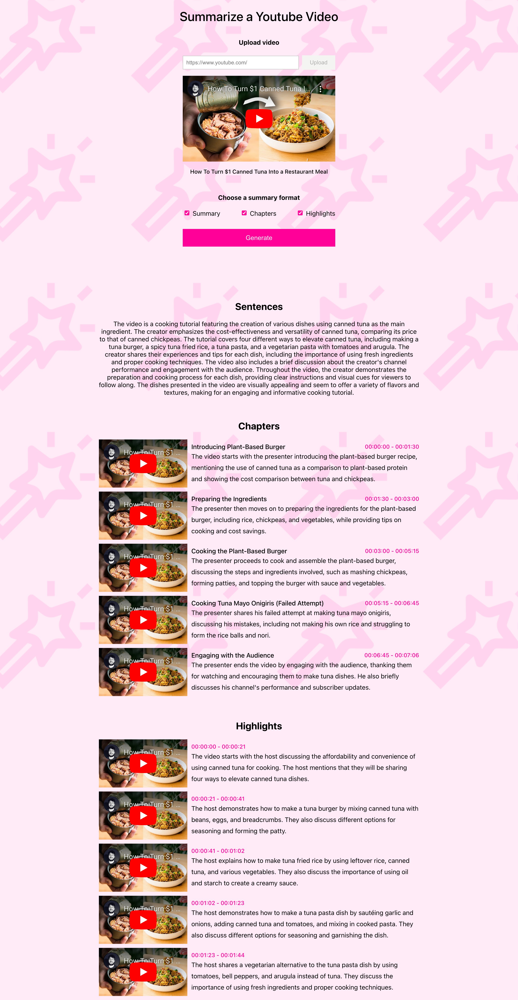

<a id="readme-top"></a>

# Summarize a Youtube Video

## 👋 Introduction

This app's got your back when you need a speedy text summary of any video in your sights. Whether you're a content creator gearing up to make your own video, or simply looking to dissect a benchmark video, this app helps you swiftly capture the essence, structure, and key highlights. It's your shortcut to finding those standout elements to make your content shine!

<div style="border: 1px solid black;">
  
</div>

### Built With

- [Twelve Labs API](https://docs.twelvelabs.io/docs)
- [JavaScript](https://developer.mozilla.org/en-US/docs/Web/JavaScript)
- [React](https://react.dev/)
- [React Player](https://www.npmjs.com/package/react-player)
- [ytdl-core](https://www.npmjs.com/package/ytdl-core)

<p align="right">(<a href="#readme-top">back to top</a>)</p>

## 🔑 Getting Started

### Step 1. Clone the repo

```sh
git clone git@github.com:mrnkim/summarize-youtube-video.git
```

### Step 2. Generate API Key and create an Index

1. Visit [Twelve Labs Playground](https://playground.twelvelabs.io/) to generate your API Key
   - Once you sign up, you'll receive complimentary credits allowing you to index up to 10 hours of video content!
2. Create an index and save the index id (Visit [Twelve Labs Docs](https://docs.twelvelabs.io/docs/create-indexes) for details)
3. Create `.env` file at the root level and store/update the values of SERVER_URL, PORT_NUMBER, API_KEY, and INDEX_ID.
   (* API_URL should be the link below (v1.2))

   ```
   .env

    REACT_APP_SERVER_URL=<YOUR_SERVER_URL> //e.g., http://localhost
    REACT_APP_PORT_NUMBER=<YOUR_PORT_NUMBER> //e.g., 4001
    REACT_APP_API_URL=https://api.twelvelabs.io/v1.2
    REACT_APP_API_KEY=<YOUR_API_KEY>
    REACT_APP_INDEX_ID=<YOUR_INDEX_ID>

   ```

### Step 3. Start the server and the client

1. Start the server

   ```sh
   nodemon server.js
   ```

1. Install and start the client

   ```sh
   npm install
   npm start
   ```

<p align="right">(<a href="#readme-top">back to top</a>)</p>

## 🎯 What's Next?

- Add tests
- Improve error handling and add data validations

<p align="right">(<a href="#readme-top">back to top</a>)</p>
